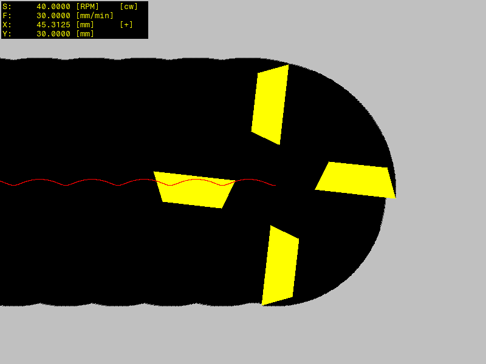

# Симулятор фрезерования

**Симулятор фрезерования** - это графическое десктопное приложение, которое симулирует процесс металлообработки операцией фрезерования. Симуляция показывает основную механику процесса: вращающийся режущий инструмент (фреза), центр которого находится на некотором расстоянии относительно своего центра вращения (биение), проходит через обрабатываемый материал (условно - металл). Фактический центр инструмента отбрасывает траекторию.

\
*Процесс фрезерования*

Можно управлять процессом обработки металла, используя клавиатуру.

## Клавиши управления

* Выход из программы - клавиша *Esc*.
* Перезапуск материала и начального положения инструмента - клавиша *Enter*.
* Остановить/возобновить подачу - клавиша *Пробел*.
* Остановить/возобновить вращение - клавиша *Ctrl*.
* Развернуть направление вращения - клавиша *Alt*.
* Изменить направление движения инструмента - клавиши *влево*, *вправо*, *вверх*, *вниз*.
* Уменьшить скорость подачи - клавиша */*.
* Увеличить скорость подачи - клавиша *\**.
* Уменьшить скорость вращения - клавиша *-*.
* Увеличить скорость вращения - клавиша *+*.

Биение инструмента, количество зубьев, режимы резания и другие настройки можно изменить в файле конфигурации:

```
vim ./configs/config.yml
```

## Системные требования

**Операционная система:**

- Windows / MacOS / Linux.

**Программное обеспечение:**

- средства разработки языка Python >=v3.6;
- менеджер пакетов pip языка Python;
- утилита make.

## Установка и запуск

Перед запуском следует скачать и установить пакеты, которые используются в данном приложении.

```
pip install pyyaml pygame
```

Запустить программу можно командой:

```
make fast-run
```

Или эквивалентной ей командой:

```
make
```
