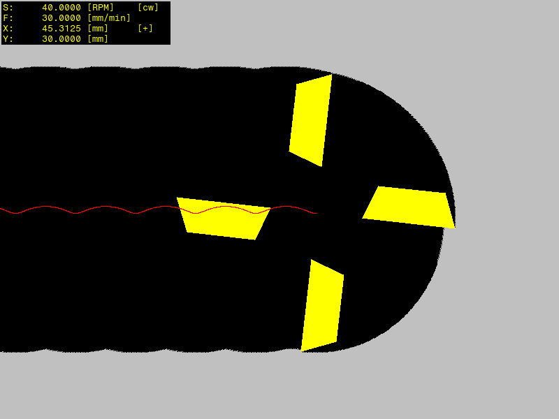

# Симулятор фрезерования

**Симулятор фрезерования** - это графическое десктопное приложение, которое симулирует процесс металлообработки операцией фрезерования.

Симуляция показывает основную механику процесса: вращающийся режущий инструмент (фреза), центр которого находится на некотором расстоянии относительно своего центра вращения (биение), проходит через обрабатываемый материал (условно - металл). Фактический центр инструмента отбрасывает траекторию.

\
*Процесс фрезерования, отображаемый на экране*

## Управление

Нажимайте клавиши на клавиатуре, чтобы управлять процессом обработки.

* Остановить/возобновить подачу - клавиша *Пробел*.
* Остановить/возобновить вращение - клавиша *Ctrl*.
* Развернуть направление вращения - клавиша *Alt*.
* Изменить направление движения инструмента - клавиши *влево*, *вправо*, *вверх*, *вниз*.
* Уменьшить скорость подачи - клавиша */*.
* Увеличить скорость подачи - клавиша *\**.
* Уменьшить скорость вращения - клавиша *-*.
* Увеличить скорость вращения - клавиша *+*.
* Перезапуск материала и начального положения инструмента - клавиша *Enter*.
* Выход из программы - клавиша *Esc*.

## Конфигурация

Откройте и отредактируйте файл конфигурации, чтобы изменить биение инструмента, количество зубьев, режимы резания и другие настройки.

```
vim ./configs/config.yml
```

## Системные требования

**Операционная система:**

- Windows / macOS / Linux/UNIX.

**Программное обеспечение:**

- язык программирования Python >=3.6;
- менеджер пакетов pip для Python;
- утилита make.

## Установка и запуск

Скачайте и установите пакеты, необходимые для данного приложения.

```
pip install pyyaml pygame
```

Запустите программу.

```
make fast-run
```

Запустите программу (сокращенная команда).

```
make
```
